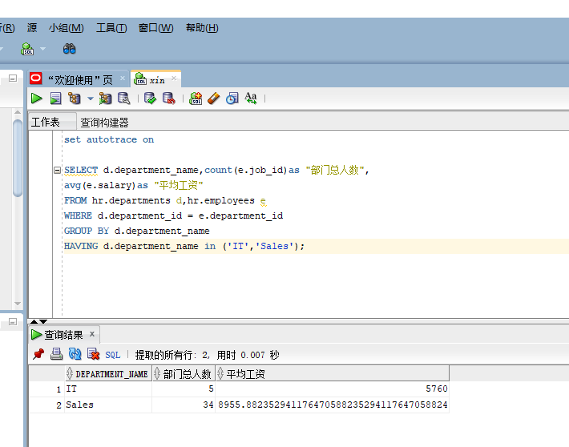
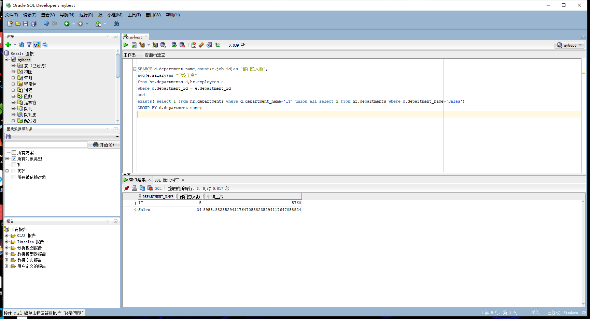

# 实验一:sql语句的执行计划分析与优化指导
### 实验目的 分析SQL执行计划，执行SQL语句的优化指导。理解分析SQL语句的执行计划的重要作用。

### 实验内容:
对Oracle12c中的HR人力资源管理系统中的表进行查询与分析。
首先运行和分析教材中的样例：本训练任务目的是查询两个部门('IT'和'Sales')的部门总人数和平均工资，以下两个查询的结果是一样的。但效率不相同。
#### 查询一

```
set autotrace on

SELECT d.department_name,count(e.job_id)as "部门总人数",
avg(e.salary)as "平均工资"
from hr.departments d,hr.employees e
where d.department_id = e.department_id
and d.department_name in ('IT','Sales')
GROUP BY d.department_name;
...

#### 查询二


set autotrace on

SELECT d.department_name,count(e.job_id)as "部门总人数",
avg(e.salary)as "平均工资"
FROM hr.departments d,hr.employees e
WHERE d.department_id = e.department_id
GROUP BY d.department_name
HAVING d.department_name in ('IT','Sales');


#### 查询三(自己写的)


SELECT first_name 员工名字,country_name 所属城市
from employees e,locations l,countries c,departments d
where e.department_id=d.department_id and d.location_id=l.location_id and l.country_id=c.country_id and c.country_name='United States of America'
group by first_name，country_name;
```
查询结果展示:
---



---

查询1比查询2的sql语句更优！

- 查询结果：




- 分析：exists 判断子查询是否返回，类似一个布尔判断，in 的话要执行完子查询再执行主查询，方式不一样，exists方式明显快于in。
