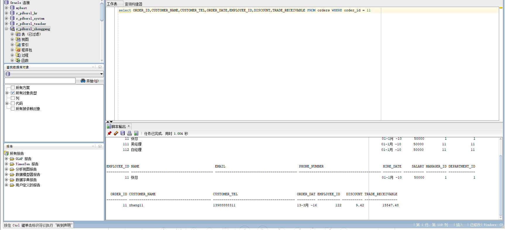
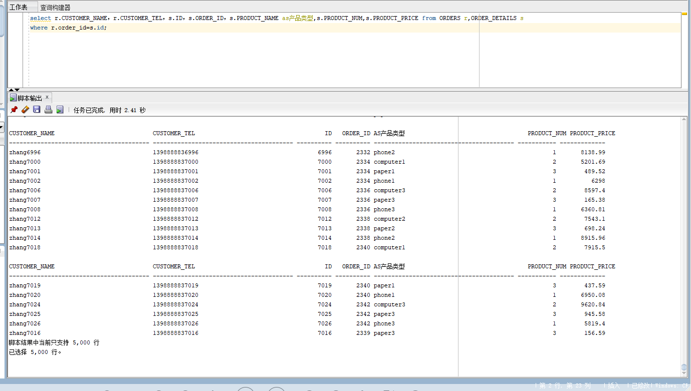

# 实验四：对象管理

###实验目的：
   了解Oracle表和视图的概念，学习使用SQL语句Create Table创建表，学习Select语句插入，修改，删除以及查询数据，学习使用SQL语句创建视图，学习部分存储过程和触发器的使用。

##实验步骤
###1.删除表和序列
删除语句展示
```sql
declare
      num   number;
begin
      select count(1) into num from user_tables where TABLE_NAME = 'DEPARTMENTS';
      if   num=1   then
          execute immediate 'drop table DEPARTMENTS cascade constraints PURGE';
      end   if;
      select count(1) into num from user_tables where TABLE_NAME = 'EMPLOYEES';
      if   num=1   then
          execute immediate 'drop table EMPLOYEES cascade constraints PURGE';
      end   if;
      select count(1) into num from user_tables where TABLE_NAME = 'ORDER_ID_TEMP';
      if   num=1   then
          execute immediate 'drop table ORDER_ID_TEMP cascade constraints PURGE';
      end   if;
      select count(1) into num from user_tables where TABLE_NAME = 'ORDER_DETAILS';
      if   num=1   then
          execute immediate 'drop table ORDER_DETAILS cascade constraints PURGE';
      end   if;
      select count(1) into num from user_tables where TABLE_NAME = 'ORDERS';
      if   num=1   then
          execute immediate 'drop table ORDERS cascade constraints PURGE';
      end   if;
      select count(1) into num from user_tables where TABLE_NAME = 'PRODUCTS';
      if   num=1   then
          execute immediate 'drop table PRODUCTS cascade constraints PURGE';
      end   if;
      select count(1) into num from user_sequences where SEQUENCE_NAME = 'SEQ_ORDER_DETAILS_ID';
      if   num=1   then
          execute immediate 'drop  SEQUENCE SEQ_ORDER_DETAILS_ID';
      end   if;
      select count(1) into num from user_sequences where SEQUENCE_NAME = 'SEQ_ORDER_ID';
      if   num=1   then
          execute immediate 'drop  SEQUENCE SEQ_ORDER_ID';
      end   if;
      select count(1) into num from user_views where VIEW_NAME = 'VIEW_ORDER_DETAILS';
      if   num=1   then
          execute immediate 'drop VIEW VIEW_ORDER_DETAILS';
      end   if;
      SELECT count(object_name)  into num FROM user_objects_ae WHERE object_type = 'PACKAGE' and OBJECT_NAME='MYPACK';
      if   num=1   then
          execute immediate 'DROP PACKAGE MYPACK';
      end   if;
end;
```
删除结果展示

###2.创建表DEPARTMENTS
部分代码展示
```sql
CREATE TABLE DEPARTMENTS
(
  DEPARTMENT_ID NUMBER(6, 0) NOT NULL
, DEPARTMENT_NAME VARCHAR2(40 BYTE) NOT NULL
, CONSTRAINT DEPARTMENTS_PK PRIMARY KEY
  (
    DEPARTMENT_ID
  )
  .
  .
  .
```
创建结果展示


###3.创建表EMPLOYEES
部分代码展示：
```sql
CREATE TABLE EMPLOYEES
(
  EMPLOYEE_ID NUMBER(6, 0) NOT NULL
, NAME VARCHAR2(40 BYTE) NOT NULL
, EMAIL VARCHAR2(40 BYTE)
, PHONE_NUMBER VARCHAR2(40 BYTE)
, HIRE_DATE DATE NOT NULL
, SALARY NUMBER(8, 2)
, MANAGER_ID NUMBER(6, 0)
, DEPARTMENT_ID NUMBER(6, 0)
, PHOTO BLOB
, CONSTRAINT EMPLOYEES_PK PRIMARY KEY
  (
    EMPLOYEE_ID
  )
  .
  .
  .
```
创建结果展示


###4.创建表PRODUCTS
代码展示
```sql
CREATE TABLE PRODUCTS
(
  PRODUCT_NAME VARCHAR2(40 BYTE) NOT NULL
, PRODUCT_TYPE VARCHAR2(40 BYTE) NOT NULL
, CONSTRAINT PRODUCTS_PK PRIMARY KEY
  (
    PRODUCT_NAME
  )
  ENABLE
)
LOGGING
TABLESPACE "USERS"
PCTFREE 10
INITRANS 1
STORAGE
(
  INITIAL 65536
  NEXT 1048576
  MINEXTENTS 1
  MAXEXTENTS 2147483645
  BUFFER_POOL DEFAULT
);

ALTER TABLE PRODUCTS
ADD CONSTRAINT PRODUCTS_CHK1 CHECK
(PRODUCT_TYPE IN ('耗材', '手机', '电脑'))
ENABLE;
```
创建结果展示：


###5.创建表ORDERS
部分代码展示
```sql
CREATE TABLE ORDERS
(
  ORDER_ID NUMBER(10, 0) NOT NULL
, CUSTOMER_NAME VARCHAR2(40 BYTE) NOT NULL
, CUSTOMER_TEL VARCHAR2(40 BYTE) NOT NULL
, ORDER_DATE DATE NOT NULL
, EMPLOYEE_ID NUMBER(6, 0) NOT NULL
, DISCOUNT NUMBER(8, 2) DEFAULT 0
, TRADE_RECEIVABLE NUMBER(8, 2) DEFAULT 0
)
.
.
.
```
结果展示：


###6.本地分区索引，触发器的创建
结果展示：


##查询数据
### 1.查询某个员工的信息
查询语句展示
```sql
select EMPLOYEE_ID,NAME,EMAIL,PHONE_NUMBER,HIRE_DATE,SALARY,MANAGER_ID,DEPARTMENT_ID FROM employees WHERE employee_ID = 11;
```
查询结果展示


### 2.递归查询某个员工及其所有下属
查询代码展示
```sql
WITH A (EMPLOYEE_ID,NAME,EMAIL,PHONE_NUMBER,HIRE_DATE,SALARY,MANAGER_ID,DEPARTMENT_ID) AS
  (SELECT EMPLOYEE_ID,NAME,EMAIL,PHONE_NUMBER,HIRE_DATE,SALARY,MANAGER_ID,DEPARTMENT_ID
    FROM employees WHERE employee_ID = 11
    UNION ALL
  SELECT B.EMPLOYEE_ID,B.NAME,B.EMAIL,B.PHONE_NUMBER,B.HIRE_DATE,B.SALARY,B.MANAGER_ID,B.DEPARTMENT_ID
    FROM A, employees B WHERE A.EMPLOYEE_ID = B.MANAGER_ID)
SELECT * FROM A;
```
查询结果展示


### 3.查询订单表
查询语句
```sql
select ORDER_ID,CUSTOMER_NAME,CUSTOMER_TEL,ORDER_DATE,EMPLOYEE_ID,DISCOUNT,TRADE_RECEIVABLE FROM orders WHERE order_id = 11
```
查询结果


### 4.查询订单详表
查询语句
```sql
select r.CUSTOMER_NAME，r.CUSTOMER_TEL，s.ID，s.ORDER_ID，s.PRODUCT_NAME ,s.PRODUCT_NUM,s.PRODUCT_PRICE from ORDERS r,ORDER_DETAILS s
where r.order_id=s.id;
```
查询结果


### 5.查询出所有的部门
查询语句
```sql
select r.DEPARTMENT_ID,r.DEPARTMENT_NAME,s.MANAGER_ID from EMPLOYEES s,DEPARTMENTS r where r.DEPARTMENT_ID=s.DEPARTMENT_ID;
```
结果展示


