### 实验六(期末考核)基于Oracle的员工管理系统数据库设计
- 期末考核要求
- 自行设计一个信息系统的数据库项目，自拟某项目名称
- 设计项目涉及的表及表空间使用方案。至少5张表和5万条数据，两个表空间。
-    设计权限及用户分配方案。至少两类角色，两个用户。
-    在数据库中建立一个程序包，在包中用PL/SQL语言设计一些存储过程和函数，实现比较复杂的业务逻辑，用模拟数据进行执行计划分析。
-    设计自动备份方案或则手工备份方案。
-    设计容灾方案。使用两台主机，通过DataGuard实现数据库整体的异地备份。
#### 1.系统概述
###### 越来越多的网络用户希望能够在网络平台上更多地展现自己的个性，更方便地与人互动交流，在传统的WEB1.0时代，无论是论坛、社区还是公司管理，都试图在这些方面进行努力，随着WEB2. 0时代的到来，我们可以用一个新型的系统来管理公司员工.员工信息管理是一个企业必不可少的部分，随着计算机和计算机知识的普及，员工信息管理系统得到了更大的发展空间，通过对员工信息管理系统的开发，可以提高管理人员和公司职员的工作效率。
###### 员工信息管理是一个企业不可缺少的部分，一个良好的员工信息管理系统应该能够为公司职员提供充足的信息和快捷的查询手段。员工信息管理系统对企业加强人员管理和资金管理有着极其重要的作用，由于公司员工数量的增多，对管理人才需求的越来越高，对于如何管理制作如此庞大的员工数量以及人员的绩效显得更为复杂，传统的手工成绩管理不仅工作量大，而且容易出现问题，如：效率低、保密性差，另外时间一长，将产生大量的文件和数据，这对于查找、更新和维护都带来了不少的困难。已不能适应时代的发展。
###### 随着科学技术的不断提高，计算机科学日渐成熟，其强大的功能已为人们深刻认识，它已进入人类社会的各个领域并发挥着越来越重要的作用。
###### 作为计算机应用的一部分，使用计算机对员工信息信息进行管理，具有手工管理所无法比拟的优点。例：检索迅速、查找方便、可靠性高、存储量大、保密性好、寿命长、成本低等。这些优点能够极大地提高管理者管理的效率，也是企业走向科学化、正规化管理与性界物的重变条件。
######       因此，开发设计这样一套员工信息管理的数据库系统成为很有必要的事情。
#### 2.实体模型
#####  根据应用场景分析，共有5个实体，他们是部门，职位，员工，工资，绩效奖励部门( department)，包括部门ID(department_id），部门成员（department_content），员工（staff），员工职位（staff_post），员工工资（staff_salary），员工奖金（staff_bonus），还应该包括管理人员，表示是由某位管理人员发布的，员工ID表示是某一个员工，该属性可以为空，表示
#####  为终极管理员.部门表的实体如图 2-1 
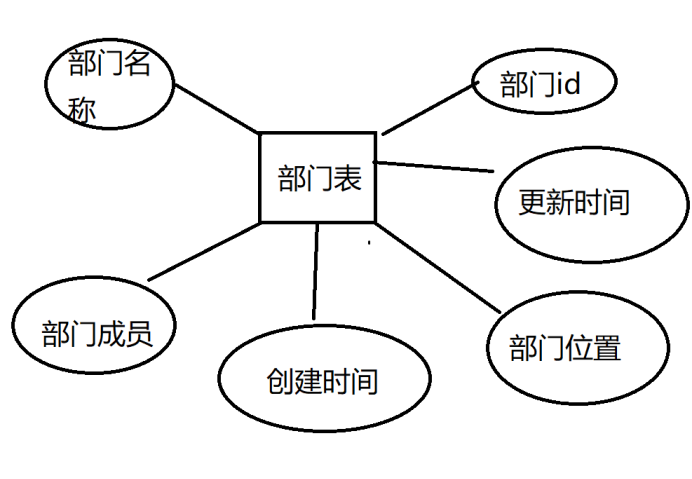   
##### 职位（post），包括，职位ID（post_id），职位等级（post_grade），升职候选（post_candidate），职位的属性中还应包括部门的ID，员工ID，表示职位属于某个部门，是由某个员工的,职位的ID,表示是某员工的职位，职位的实体如图2-2
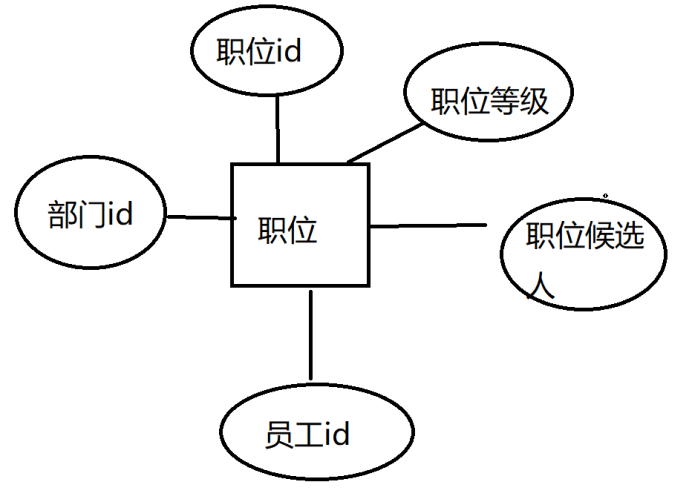)
##### 奖金（bonus），包括奖金ID（bonus_id），奖金描述（bonus_describe），奖金名称（bonus_name）奖金的实体如图2-3 
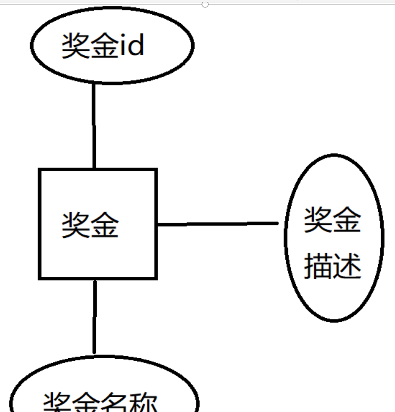
##### 员工（staff），包括员工ID（staff_id），员工名称（staff_name），员工信息（staff_content），用户手机号（staff_tel），用户头像（staff_location）用户的实体如图2-4
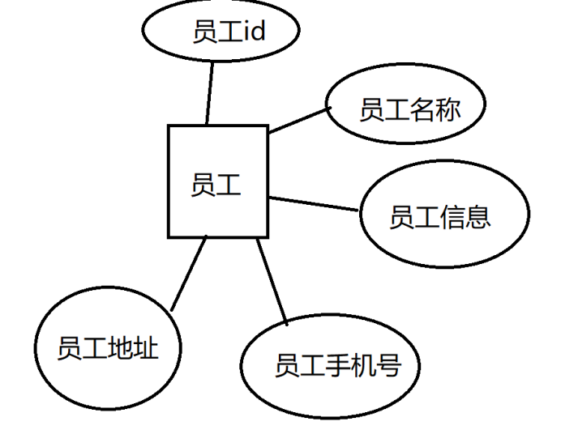
##### 工资（salary）。包括工资数（salary_number），工资等级（salary_grade），工资描述（salary_description）工资的实体如图2-5
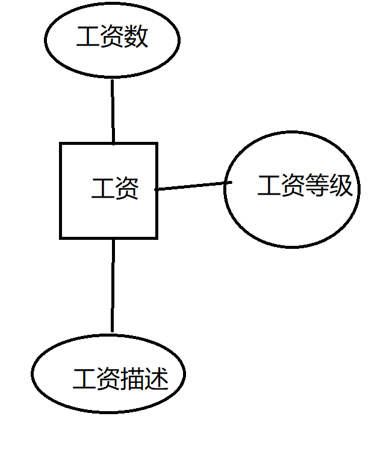
#### 3.实体联系模型
##### 每个管理员可以删改员工信息，因此管理员和员工之间就有一个“crud”的联系。在每个员工描述下面都可以发布对该员工的评价，评价会和绩效奖金挂钩.工资数又取决于员工的部门和员工的职位等,工资等级决定了工资的多少,而工资等级又由部门和员工职位决定.所以员工和工资之间就有一个“领取”的关系，在发工资的时候可以为员工设置工资等级，所以工资和员工就有一个“分发”的联系.
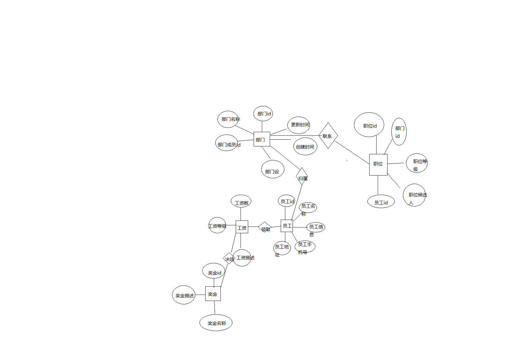
#### 4.数据表的设计
##### E-R模型建立好以后，就可以设计Oracle的关系表了，在独立实体中找出主要的属性设置为主键，在用户表中员工ID（staff_id）就是主键，在部门中部门ID（department_id）就是主键，工资表中的主键是工资ID（salary_id），在职位表中分类ID（psot_id）就是主键，在系统配置表中奖金号（bonus_id）是主键。右关系派生出的实体中要加入外键关系，部门对员工就是1对多，即在部门表中添加用户ID属性（staff_id），职位对员工也是1对多，在职员表中添加员工ID（staff_id），员工对奖金就是多对多，在员工表中添加奖金ID（salary_id）
##### 职员（staff），包括员工ID（staff_id），员工名（staff_name），员工信息（staff_message），员工手机号（staff_tel），员工地址（staff_location）见表4-1
表4-1 职员表 staff

| 字段名 | 数据类型  | 是否为空 | 注释 |
| ------ | --------- | ----------- | ------- |
| staff_id |int      | NO        |  员工id       |
| staff_name  | char(32) | NO   |      员工姓名   |
| staff_message  | char(32) | NO   |    员工信息   |
| staff_tel  | char(32) | NO   |      员工电话   |
| staff_location  | char(32) | NO   |    员工地址   |
##### 部门(department)，包括部门ID（department_id），部门成员id（department_content_id），创建日期（department_data），更新日期（department_update）,部门名称（department_title），部门设备（goods），见表4-2，注意部门表中的分类成员id可以为空，一个部门可以没有员工.
表4-2 部门表 department

| 字段名 | 数据类型  | 是否为空 | 注释 |
| ------ | --------- | ----------- | ------- |
| department_id |int      | NO   |  部门id,主键 |
| department_content_id |char(64)      | NO   |  部门成员id,外键 |
| department_data |Date    | NO   |  部门创建日期 |
| department_update |Date       | NO   |  更新时间 |
| department_title |char(32)      | NO   |  部门名称 |
| department_staff |char(32)      | NO   |  部门员工 |
| staff_id |int      | NO   |  员工id,外键 |

##### 职位（post），包括，评论ID（post_id），评论日期（post_candidate），职员id（staff_id）,部门id(department_id)见表4-3
表4-3 职位表 post

| 字段名 | 数据类型  | 是否为空 | 注释 |
| ------ | --------- | ----------- | ------- |
| post_id |int      | NO   |  职位id,主键 |
| post_candidate |char(32)      | NO   |  职位候选人|
| post_grade |int      | NO   |  职位等级 |
| apartment_id |int      | NO   |  部门id,外键|
| staff_id |int      | NO   |  员工id,外键 |

##### 工资（salary），包括工资ID（salary_id），工资描述（salary_describe），工资级别（salary_grade），见表4-4
表4-4 工资表 salary

| 字段名 | 数据类型  | 是否为空 | 注释 |
| ------ | --------- | ----------- | ------- |
| salary_id |int      | NO   |  工资id,主键 |
| salary_description|char(128)      | NO   |  工资描述 |
| salary_grade |int      | NO   |  工资等级 |

##### 奖金id（bonus_id）。包括奖金描述（bonus_description），奖金级别（bonus_grade），见表4-5
表4-5 绩效表 bonus

| 字段名 | 数据类型  | 是否为空 | 注释 |
| ------ | --------- | ----------- | ------- |
| bonus_id |int      | NO   |  奖金id,主键 |
| bonus_description|char(128)      | NO   |  奖金描述 |
| bonus_grade |int      | NO   |  奖金等级 |

#### 5.用户创建与空间分配
##### 表的解构设计好之后，还要考虑用户的空间分配用户
##### 创建了一个名叫xin的数据库，指定了它的存储位置，以及创建了数据库dx的管理员，创建角色system_xin和用户system_boss，并授权和分配空间

```
create p1uggable database xin admin user dx identified by 123 file_name_convert=('/home/orac1e/xin/myscott/',' /home/orac1e/xin/myscott2');|
$ sqlplus system/123@pdborcl
SQL> CREATE ROLE system_xin;
Role created.
SQL> GRANT connect,resource,CREATE VIEW TO system_xin;Grant succeeded.
SQL> CREATE USER system_boss IDENTIFIED BY 123 DEFAULT TABLESPACE users TEMPORARY TABLESPACE temp;
User created.
SQL> ALTER USER new_user QUOTA 50M ON users;
User altered.
SQL> GRANT system_xin TO system_boss;Grant succeeded.
SQL> exit
```
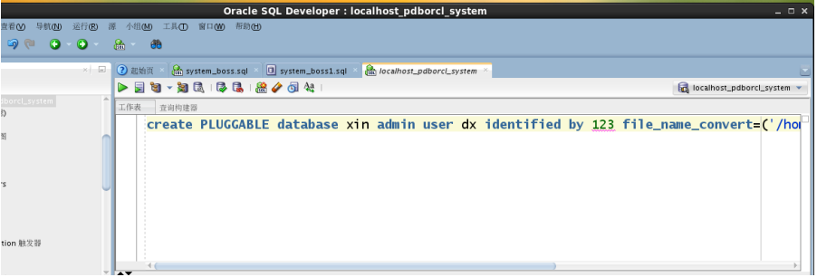
##### 然后对新创建的角色进行select,delete,insert,updata等权限.
#####      此时使用创建好的用户system_xin登录pdborcl,创建上述的实体表.
#####      创建员工表

```
CREATE TABLE STAFF 
(
  STAFF_ID NUMBER(*, 0) NOT NULL 
, STAFF_NAME VARCHAR2(20 BYTE) NOT NULL 
, STAFF_MESSAGE VARCHAR2(20 BYTE) 
, STAFF_TEL VARCHAR2(20 BYTE) 
, STAFF_LOCATION VARCHAR2(20 BYTE) 
) 
LOGGING 
TABLESPACE USERS 
PCTFREE 10 
INITRANS 1 
STORAGE 
( 
  BUFFER_POOL DEFAULT 
) 
NOCOMPRESS 
NO INMEMORY 
NOPARALLEL;
```       
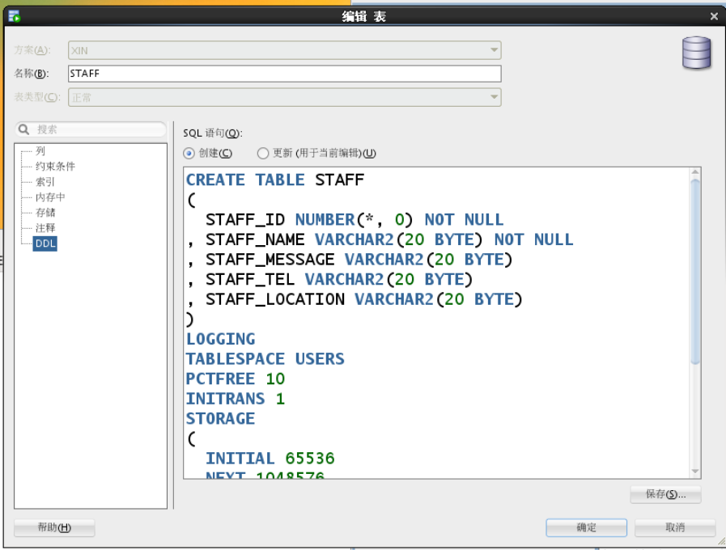
##### 创建部门表


```
CREATE TABLE DEPARTMENT 
(
  DEPARTMENT_ID NUMBER(*, 0) NOT NULL 
, DEPARTMENT_CONTENT_ID NUMBER(*, 0) 
, DEPARTMENT_DATA VARCHAR2(20 BYTE) 
, DEPARTMENT_TITLE VARCHAR2(20 BYTE) 
, DEPARTMENT_UPDATA DATE 
, DEPARTMENT_STAFF VARCHAR2(20 BYTE) 
, STAFF_ID NUMBER(*, 0) 
, GOODS VARCHAR2(20 BYTE) 
, CONSTRAINT DEPARTMENT_PK PRIMARY KEY 
  (
    DEPARTMENT_ID 
  )
  USING INDEX 
  (
      CREATE UNIQUE INDEX DEPARTMENT_PK ON DEPARTMENT (DEPARTMENT_ID ASC) 
      LOGGING 
      TABLESPACE USERS 
      PCTFREE 10 
      INITRANS 2 
      STORAGE 
      ( 
        BUFFER_POOL DEFAULT 
      ) 
      NOPARALLEL 
  )
  ENABLE 
) 
LOGGING 
TABLESPACE USERS 
PCTFREE 10 
INITRANS 1 
STORAGE 
( 
  BUFFER_POOL DEFAULT 
) 
NOCOMPRESS 
NO INMEMORY 
NOPARALLEL;
```
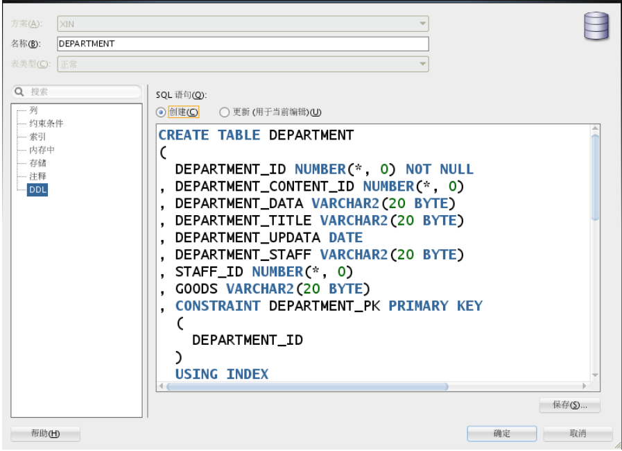

##### 创建部门表


```
CREATE TABLE DEPARTMENT 
(
  DEPARTMENT_ID NUMBER(*, 0) NOT NULL 
, DEPARTMENT_CONTENT_ID NUMBER(*, 0) 
, DEPARTMENT_DATA VARCHAR2(20 BYTE) 
, DEPARTMENT_TITLE VARCHAR2(20 BYTE) 
, DEPARTMENT_UPDATA DATE 
, DEPARTMENT_STAFF VARCHAR2(20 BYTE) 
, STAFF_ID NUMBER(*, 0) 
, GOODS VARCHAR2(20 BYTE) 
, CONSTRAINT DEPARTMENT_PK PRIMARY KEY 
  (
    DEPARTMENT_ID 
  )
  USING INDEX 
  (
      CREATE UNIQUE INDEX DEPARTMENT_PK ON DEPARTMENT (DEPARTMENT_ID ASC) 
      LOGGING 
      TABLESPACE USERS 
      PCTFREE 10 
      INITRANS 2 
      STORAGE 
      ( 
        BUFFER_POOL DEFAULT 
      ) 
      NOPARALLEL 
  )
  ENABLE 
) 
LOGGING 
TABLESPACE USERS 
PCTFREE 10 
INITRANS 1 
STORAGE 
( 
  BUFFER_POOL DEFAULT 
) 
NOCOMPRESS 
NO INMEMORY 
NOPARALLEL;
```

##### 创建职位表
```
CREATE TABLE POST 
(
  POST_ID NUMBER(*, 0) NOT NULL 
, POST_CANDIDATE VARCHAR2(20 BYTE) 
, POST_GRADE VARCHAR2(20 BYTE) 
, STAFF_ID NUMBER(*, 0) 
, APARTMENT_ID NUMBER(*, 0) 
, CONSTRAINT POST_PK PRIMARY KEY 
  (
    POST_ID 
  )
  USING INDEX 
  (
      CREATE UNIQUE INDEX POST_PK ON POST (POST_ID ASC) 
      LOGGING 
      TABLESPACE USERS 
      PCTFREE 10 
      INITRANS 2 
      STORAGE 
      ( 
        BUFFER_POOL DEFAULT 
      ) 
      NOPARALLEL 
  )
  ENABLE 
) 
LOGGING 
TABLESPACE USERS 
PCTFREE 10 
INITRANS 1 
STORAGE 
( 
  BUFFER_POOL DEFAULT 
) 
NOCOMPRESS 
NO INMEMORY 
NOPARALLEL;
```
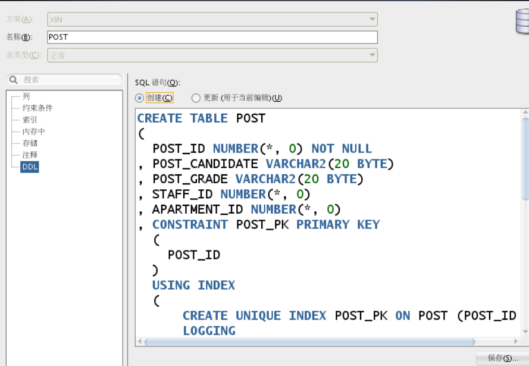
##### 创建工资表


```
CREATE TABLE SALARY 
(
  SALARY_ID NUMBER(*, 0) NOT NULL 
, SALARY_DESCRIPTION VARCHAR2(20 BYTE) 
, SALARY_GRADE NUMBER(*, 0) 
, CONSTRAINT SALARY_PK PRIMARY KEY 
  (
    SALARY_ID 
  )
  USING INDEX 
  (
      CREATE UNIQUE INDEX SALARY_PK ON SALARY (SALARY_ID ASC) 
      LOGGING 
      TABLESPACE USERS 
      PCTFREE 10 
      INITRANS 2 
      STORAGE 
      ( 
        BUFFER_POOL DEFAULT 
      ) 
      NOPARALLEL 
  )
  ENABLE 
) 
LOGGING 
TABLESPACE USERS 
PCTFREE 10 
INITRANS 1 
STORAGE 
( 
  BUFFER_POOL DEFAULT 
) 
NOCOMPRESS 
NO INMEMORY 
NOPARALLEL;
```
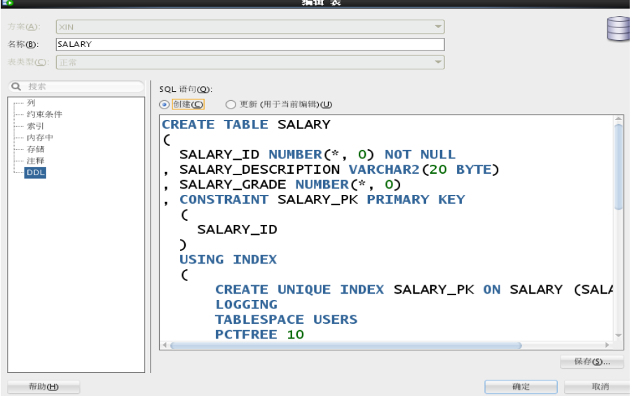


##### 创建绩效表
```
CREATE TABLE BONUS 
(
  BONUS_ID NUMBER(*, 0) NOT NULL 
, BONUS_DESCRIPTION VARCHAR2(20 BYTE) 
, BONUS_GRADE NUMBER(*, 0) 
, CONSTRAINT BONUS_PK PRIMARY KEY 
  (
    BONUS_ID 
  )
  USING INDEX 
  (
      CREATE UNIQUE INDEX BONUS_PK ON BONUS (BONUS_ID ASC) 
      LOGGING 
      TABLESPACE USERS 
      PCTFREE 10 
      INITRANS 2 
      STORAGE 
      ( 
        BUFFER_POOL DEFAULT 
      ) 
      NOPARALLEL 
  )
  ENABLE 
) 
LOGGING 
TABLESPACE USERS 
PCTFREE 10 
INITRANS 1 
STORAGE 
( 
  BUFFER_POOL DEFAULT 
) 
NOCOMPRESS 
NO INMEMORY 
NOPARALLEL;
```
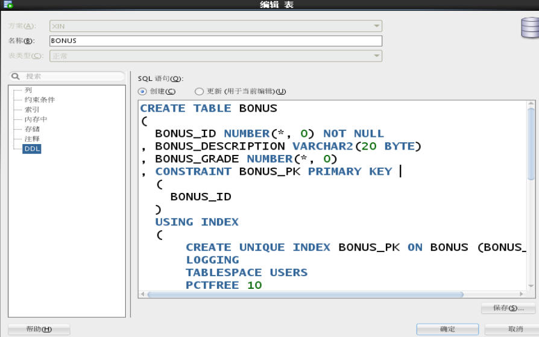
##### 创建用户,授权,插入数据，以及对分区，授权的验证
```
create user system_boss IDENTIFIED by 123;
create user system_xin IDENTIFIED by 123;
alter user system_boss quota unlimited on xin_space1;
alter user system_xin quota unlimited on xin_space1;
```

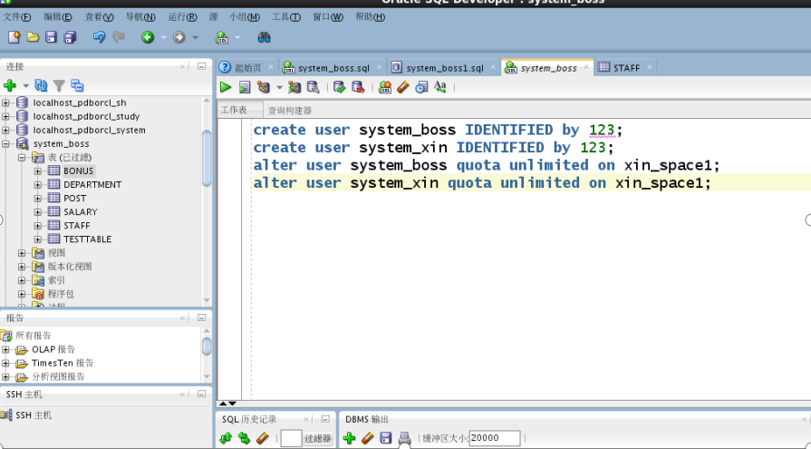

###### 由于要插入至少五万条数据,因此先创建一个测试表进行,进行测试数据的插入.
###### 创建测试表

```
CREATE TABLE TESTTABLE 
(
  ID NUMBER 
, INC_DATETIME VARCHAR2(19 BYTE) 
, RANDOM_ID NUMBER 
, RANDOM_STRING VARCHAR2(4000 BYTE) 
) 
LOGGING 
TABLESPACE USERS 
PCTFREE 10 
INITRANS 1 
STORAGE 
( 
  INITIAL 65536 
  NEXT 1048576 
  MINEXTENTS 1 
  MAXEXTENTS UNLIMITED 
  BUFFER_POOL DEFAULT 
) 
NOCOMPRESS 
NO INMEMORY 
NOPARALLEL;
```
###### 然后向测试表TESTTABLE中插入10万数据进行测试.
```
create table TestTable as 
select rownum as id,
               to_char(sysdate + rownum/24/3600, 'yyyy-mm-dd hh24:mi:ss') as inc_datetime,
               trunc(dbms_random.value(0, 100)) as random_id,
               dbms_random.string('x', 20) random_string
          from dual
        connect by level <= 100000;
```
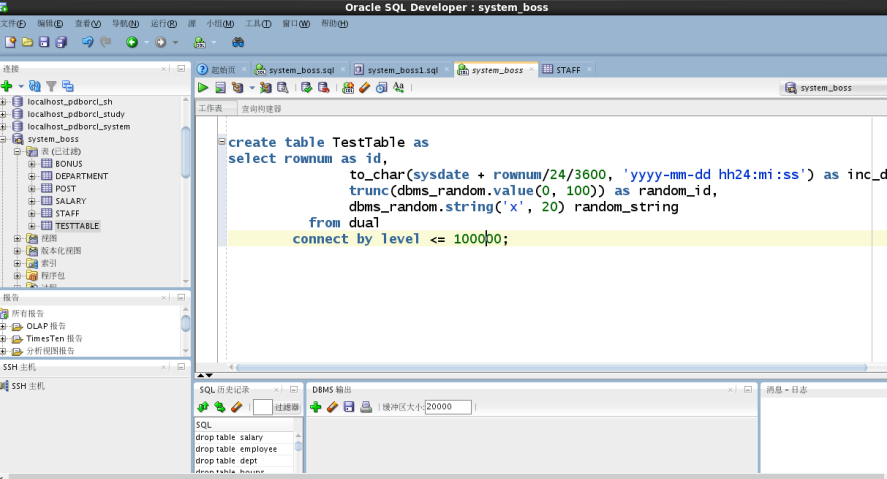
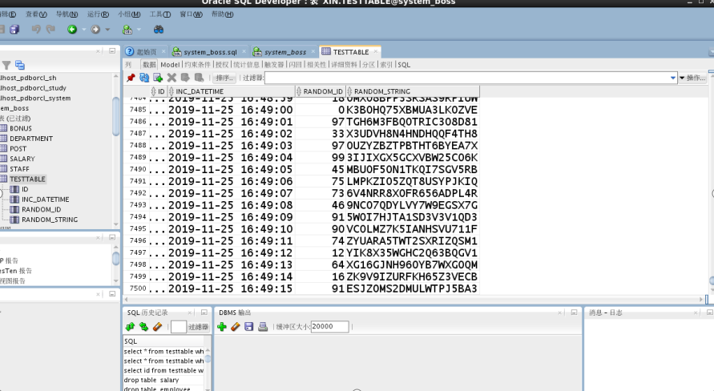
###### 之后开始对五张实体表进行数据插入
###### 奖金表数据分为三个奖项,一等奖金20k,二等奖15k,三等奖金12k.
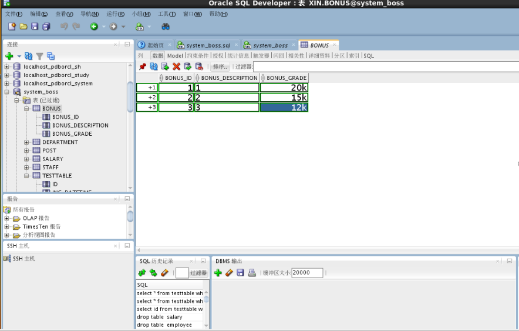
###### 然后是对部门表进行数据的插入,总共有测试部门,研发部门,产品部门,销售部门
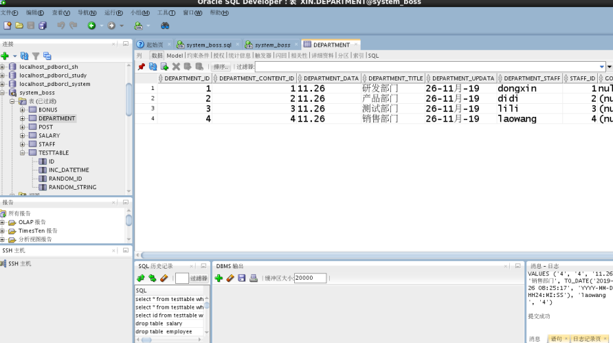
###### 然后对职位表post 进行数据插入
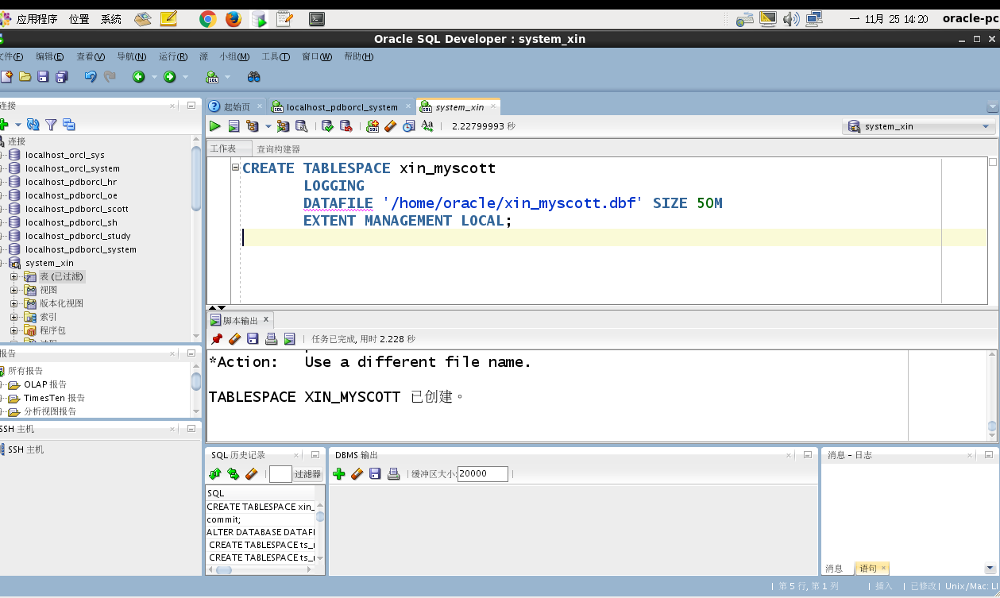
#### 6.程序包的建立
##### 建立一个程序包里面有一个函数和一个存储过程,用来统计员工的工资和奖金.
```
create or replace PACKAGE xinPack IS
  FUNCTION Get_TOTAL(dt1 char,dt2 char) RETURN NUMBER;
  PROCEDURE get_people(dt1 char,dt2 char);
END xinPack;
/
create or replace PACKAGE BODY xinPack IS
FUNCTION Get_TOTAL(dt1 char,dt2 char) RETURN NUMBER
  AS
    N  NUMBER;
    BEGIN
     select sum(price) into N from REGISTRATION_FORM where REGISTRATION_DATE >= to_date(dt1,'yyyy-mm-dd hh24:mi:ss')
     and REGISTRATION_DATE <= to_date(dt2,'yyyy-mm-dd hh24:mi:ss');
       RETURN N;
    END;

-- 得到每个部门的工资总额
PROCEDURE get_apartment_total(dt1 char,dt2 char)
  AS
    a1 NUMBER;
    b1 NUMBER;
    c1 NUMBER;
    d1 NUMBER;
    cursor cur is
      select * from REGISTRATION_FORM where REGISTRATION_DATE >= to_date(dt1,'yyyy-mm-dd hh24:mi:ss')
      and REGISTRATION_DATE <= to_date(dt2,'yyyy-mm-dd hh24:mi:ss');
    begin
      a1 := 0;
      b1 := 0;
      c1 := 0;
      d1 := 0;
      --使用游标
      for v in cur 
      LOOP
         if v.REGISTRATION_CLASS = '研发部门'
	        then a1 := a1 + 1;
         elsif v.REGISTRATION_CLASS = '产品部门'
	        then b1 := b1 + 1;
	     elsif v.REGISTRATION_CLASS = '测试部门'
	        then c1 := c1 + 1;
	     elsif v.REGISTRATION_CLASS = ‘销售部门'
	        then d1 := d1 + 1;
	     end if;
    end;
END xinPack;
```
#### 7.系统的定时备份
##### 对人员管理系统的数据库做定时备份:
##### 编写rman增量备份脚本
```
#rman_level1.sh 
#!/bin/sh

export NLS_LANG='SIMPLIFIED CHINESE_CHINA.AL32UTF8'
export ORACLE_HOME=/home/oracle/xin/dbhome_1  
export ORACLE_SID=orcl  
export PATH=$ORACLE_HOME/bin:$PATH  

rman target / nocatalog msglog=/home/oracle/xin/rman_backup/lv1_`date +%Y%m%d-%H%M%S`_L0.log << EOF
run{
configure retention policy to redundancy 1;
configure controlfile autobackup on;
configure controlfile autobackup format for device type disk to '/home/oracle/xin/rman_backup/%F';
configure default device type to disk;
crosscheck backup;
crosscheck archivelog all;
allocate channel c1 device type disk;
backup as compressed backupset incremental level 1 database format '/home/oracle/rman_backup/dblv1_%d_%T_%U.bak'
   plus archivelog format '/home/oracle/xin/rman_backup/arclv1_%d_%T_%U.bak';
report obsolete;
delete noprompt obsolete;
delete noprompt expired backup;
delete noprompt expired archivelog all;
release channel c1;
}
EOF
exit
```
###### 进行一遍测试
###### 开始备份
```
[oracle@oracle-pc ~]$ cat rman_level.sh
[oracle@oracle-pc ~]$ ./rman_level.sh
```
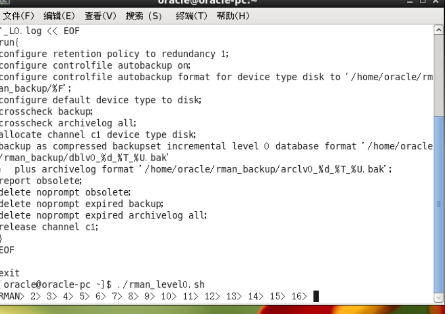

###### 备份之后进行模拟数据库损坏,删除数据库文件.


```
[oracle@oracle-pc ~]$ rm /home/oracle/app/oracle/oradata/orcl/pdborcl/SAMPLE_SCHEMA_users01.dbf
```

###### 然后进行数据库的恢复

```
sqlplus / as sysdba
shutdown immediate
shutdown abort
startup mount
rman target /
之后可以删除备份集,也可以保留.
```
#### 8.容灭方案设计 dataGuard
###### 先搭建一套oracle rac环境,
######       设置本地hosts
```
vi /etc/hosts
127.0.0.1 localhost
 
# Public Network - (eth0)
 
192.168.186.11  rac1
 
192.168.186.12  rac2
 
# Private Interconnect - (eth1)
 
192.168.40.11  rac1-priv
 
192.168.40.12  rac2-priv
 
# Public Virtual IP (VIP) addresses - (eth0:1)
 
192.168.186.13  rac1-vip
 
192.168.186.14  rac2-vip
 
# Single Client Access Name (SCAN)
 
192.168.186.10 racscan
 
# Private Storage Network
 
192.168.186.15  storage
 
192.168.40.15  storage
```
##### 安装补丁包
```
yum -y install gcc elfutils-libelf-devel gcc-c++ libaio-devel
```
##### 创建一个用户和表空间:数据文件存放在/home/oracle/xin/data中
##### 然后进行数据盘的挂载,关闭oracle rac集群服务,停止读写数据,搭载另一套容灾oracle rac环境,安装集群软件Grid Infrastructure,数据库软件Database,注意不要创建数据库实例.
##### 复制生产环境下的/home/xin/data 中的两个挂载lun,把备份的两个lun挂载到容灾环境的系统下.
#####  在容灾环境的节点上修改权限
```
chown grid:oinstall /dev/raw/raw4
chown grid:oinstall /dev/raw/raw5
```
##### 在容灾环境的两个节点上分别创建好目录和授权
```
mkdir -p /home/oracle/xin/pratice/admin/
chown -R oracle:oinstall /home/oracle/xin/pratice/admin/
```
##### 然后分别配置两个节点

```

vi/home/oracle/xin/pratice/admin/initracdb1.ora
添加以下内容：
-------------------------------------------------------------
SPFILE='+DATA/racdb/spfileracdb.ora'
-------------------------------------------------------------
vi /home/oracle/xin/pratice/admin/initracdb2.ora
添加以下内容：
-------------------------------------------------------------
SPFILE='+DATA/racdb/spfileracdb.ora'
-------------------------------------------------------------

```
##### 在两个节点下进行grid执行组挂载命令

```
su - grid
sqlplus / as sysasmalter diskgroup data mount;
```
##### 然后启动实例,把实例添加到集群配置中

```
su - oracle
srvctl status database -d racdb
srvctl add database -d racdb -o dbhome_1   
srvctl config database -d racdb
srvctl add instance -d racdb -i racdb1 -n rac1
srvctl add instance -d racdb -i racdb2 -n rac2
srvctl config database -d racdb
srvctl start database -d racdb
srvctl status database -d racdb
```
